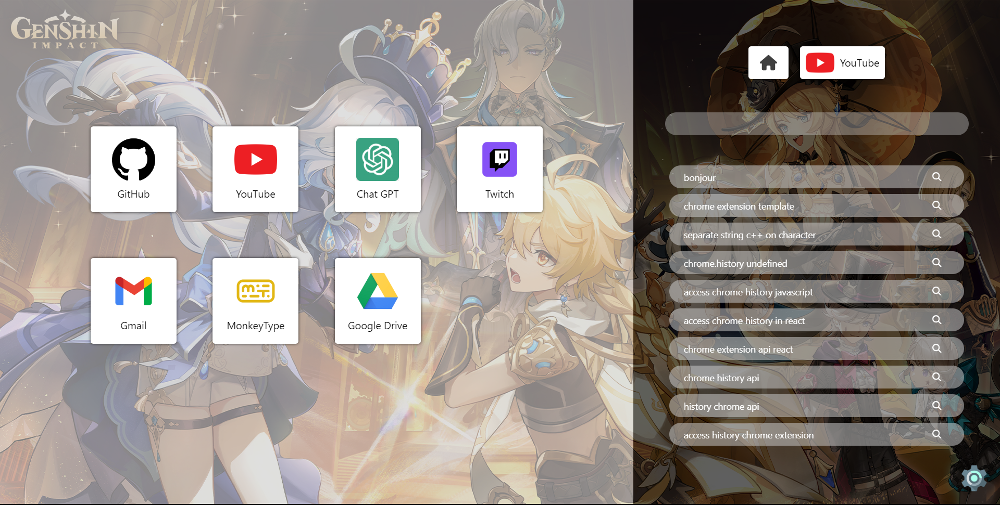
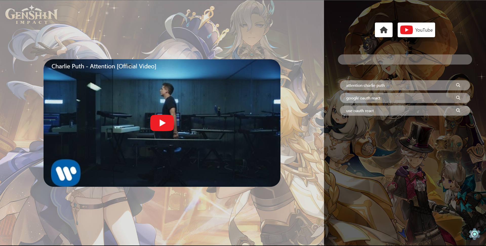
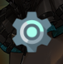
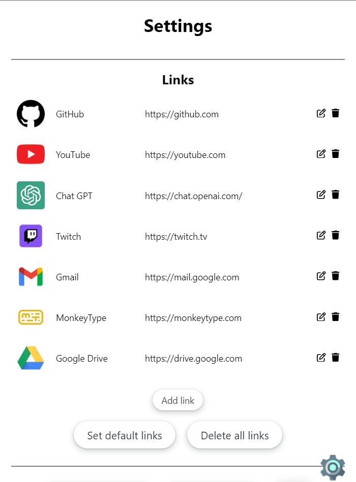
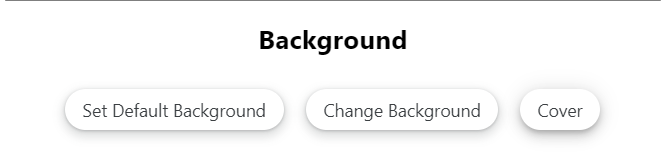
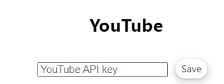

# Chrome-Homepage
This is my Custom Chrome Homepage Extension. It has been made using React.

## Install the extension

### Build the extension

Run the following command to build the extension:

```bash
cd chrome-homepage && npm run build
```

### Load the extension

For Chrome, go to `chrome://extensions` and load unpacked extension, then select the `build` folder.

## Usage

### Homepage



On the homepage, you have two panels, the left panel is the one where you can add your favorite links, and the right panel is the one where you can make a google search, see your latest searches and navigate between the main homepage and the YouTube homepage using the buttons on top of this panel.

### YouTube Homepage



As you can see, the YouTube homepage is a bit different from the main homepage, you have the thumbnail of the latest video you have watched on the left panel, and you have a YouTube search bar on the right panel, as well as your YouTube latest searches. You can also navigate between the main homepage and the YouTube homepage using the buttons on top of the right panel.

Note that for the left panel to work, you need to set your YouTube API key in the [settings](#youtube).

### Settings

You can access the settings by clicking on the settings icon on the bottom right corner of the homepage.



There are multiple sections in the settings : 

#### Links

The first one is the one where you can add your favorite links, you can add a link by clicking on the `Add Link` button, you can modify a link by clicking on the `Edit` button (to confirm, click back on the `Edit` button), and you can delete a link by clicking on the `Delete` button.

You Also have the possibility to delete all the links by clicking on the `Delete all links` button, but you can also set the default links (GitHub, YouTube, ChatGPT, Twitch, Gmail, MonkeyType and Google Drive) by clicking on the `Set default links` button.



#### Background

The second section is the one where you can change the background of the homepage, and chose how the background will be displayed (cover, contain or auto). If you want to use the default background, you can click on the `Set default background` button.



#### YouTube

This section is important to make the YouTube homepage work (especially for the video thumbnail on the left panel), you need to enter your YouTube API key, you can get one by following this [tutorial](https://developers.google.com/youtube/v3/getting-started).



Once you have set your YouTube API key, you can still remove it by clicking on the `Delete YT API key` button.

## Notes

This extension is still in development, so there are some bugs, and some new features are going to be implemented with time. This readme can be missing some features do to some future updates.

## Sources 

To create a chrome extension using React :

- https://web-highlights.com/blog/how-to-build-a-chrome-extension-using-react/
- https://blog.logrocket.com/creating-chrome-extension-react-typescript/

## Author 
[ALXS](https://github.com/ALXS-GitHub)